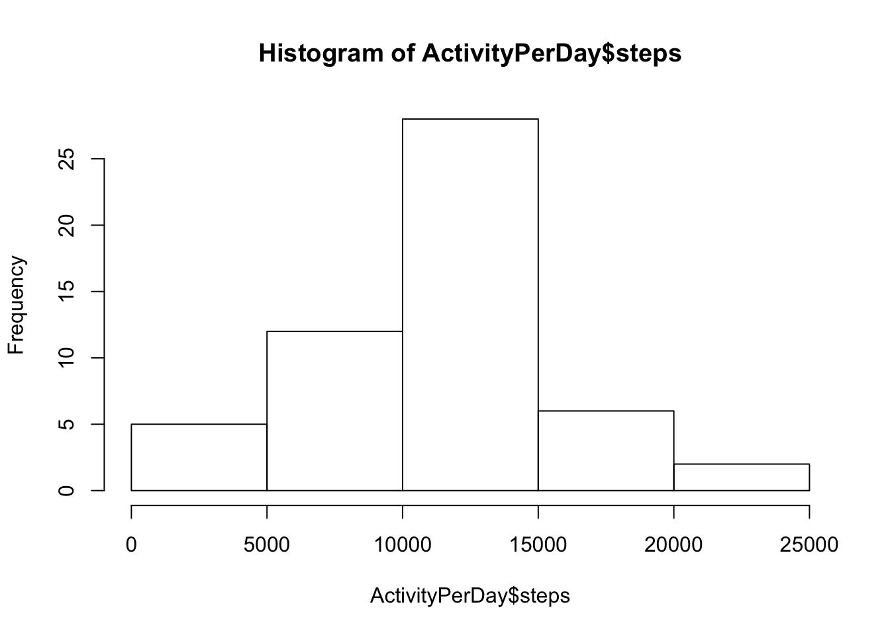
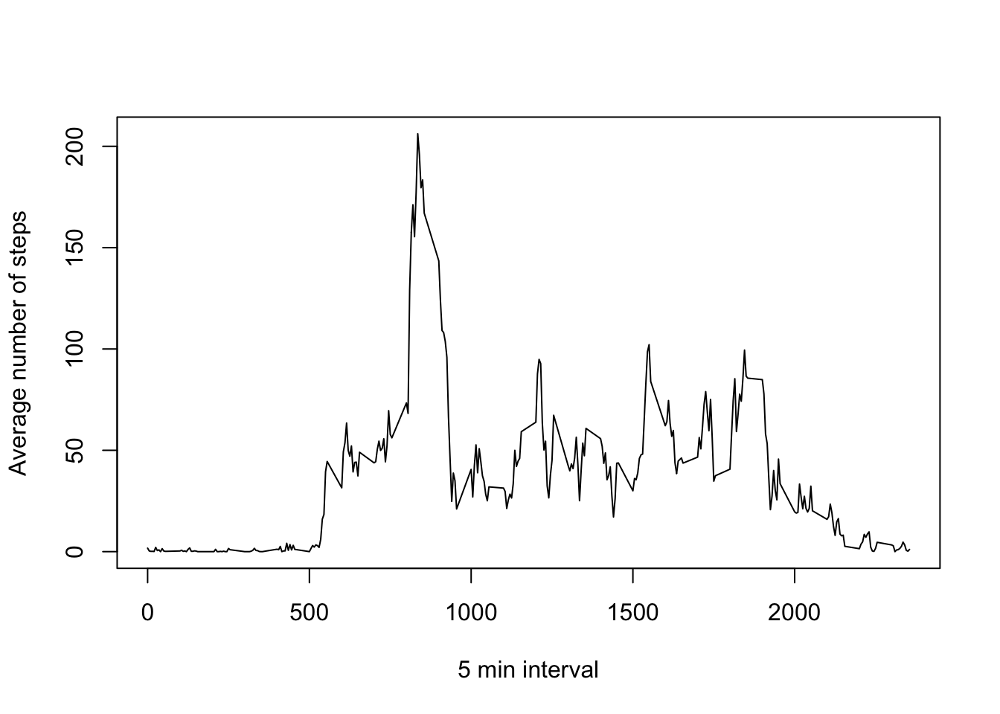
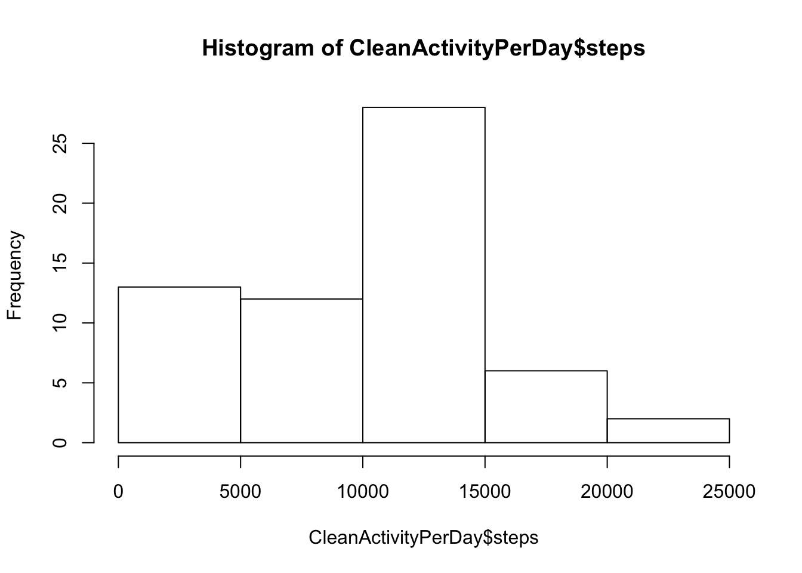
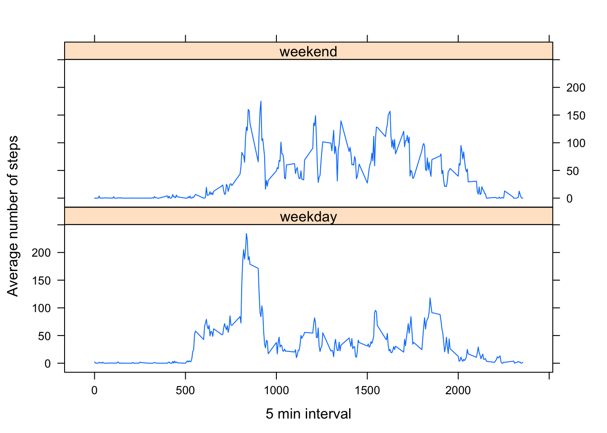

## R Markdown

1. Code for reading in the dataset and/or processing the data


```r
Activity <- read.csv(file="activity.csv", header=TRUE, sep=",")
head(Activity)
```

```
##   steps       date interval
## 1    NA 2012-10-01        0
## 2    NA 2012-10-01        5
## 3    NA 2012-10-01       10
## 4    NA 2012-10-01       15
## 5    NA 2012-10-01       20
## 6    NA 2012-10-01       25
```

```r
Activity$date<-as.POSIXct(Activity$date, format = "%Y-%m-%d")
```

2. Histogram of the total number of steps taken each day


```r
Activity$date<-as.POSIXct(Activity$date, format = "%Y-%m-%d")
ActivityPerDay<- aggregate(steps ~ date, Activity ,sum)
head(ActivityPerDay)
```

```
##         date steps
## 1 2012-10-02   126
## 2 2012-10-03 11352
## 3 2012-10-04 12116
## 4 2012-10-05 13294
## 5 2012-10-06 15420
## 6 2012-10-07 11015
```

```r
hist(ActivityPerDay$steps)
```



3. Mean and median number of steps taken each day


```r
ActivityMean <- mean(ActivityPerDay$steps)
ActivityMedian <- median(ActivityPerDay$steps)
ActivityMean
```

```
## [1] 10766.19
```

```r
ActivityMedian
```

```
## [1] 10765
```

Mean is 1.0766189\times 10^{4} and median is 10765 .

4. Time series plot of the average number of steps taken


```r
ActivityPerInterval<- aggregate(steps ~ interval, Activity , mean)
head(ActivityPerInterval)
```

```
##   interval     steps
## 1        0 1.7169811
## 2        5 0.3396226
## 3       10 0.1320755
## 4       15 0.1509434
## 5       20 0.0754717
## 6       25 2.0943396
```

```r
plot(ActivityPerInterval$interval, ActivityPerInterval$steps, type = 'l', xlab = "5 min interval", ylab = "Average number of steps")
```



5. The 5-minute interval that, on average, contains the maximum number of steps


```r
ActivityMaximun <- max(ActivityPerInterval$steps)
ActivityIntervalMaximun <- ActivityPerInterval[ActivityPerInterval$steps == ActivityMaximun,]$interval
```

The interval with maximun number of steps (on average) is 835 with 206.1698113 number of steps.

6. Code to describe and show a strategy for imputing missing data


```r
sum(is.na(Activity$steps))
```

```
## [1] 2304
```

```r
sum(is.na(Activity$interval))
```

```
## [1] 0
```

```r
sum(is.na(Activity$date))
```

```
## [1] 0
```

```r
ActivityNACount <- sum(is.na(Activity$steps))
```

The total number of missing values in the dataset is 2304.  Only the field steps contains NA values.

The strategy used to fill in the NA values is take the mean for that 5-minute interval.


```r
CleanActivity <- Activity
for (i in 1:dim(Activity)[][1]) {
    interval <- CleanActivity[i,]$interval
    mean5min <- ActivityPerInterval[1,]$steps
    CleanActivity$steps[is.na(CleanActivity$steps)] <- mean5min
 }
head(CleanActivity)
```

```
##      steps       date interval
## 1 1.716981 2012-10-01        0
## 2 1.716981 2012-10-01        5
## 3 1.716981 2012-10-01       10
## 4 1.716981 2012-10-01       15
## 5 1.716981 2012-10-01       20
## 6 1.716981 2012-10-01       25
```

7. Histogram of the total number of steps taken each day after missing values are imputed


```r
CleanActivityPerDay<- aggregate(steps ~ date, CleanActivity ,sum)
head(CleanActivityPerDay)
```

```
##         date      steps
## 1 2012-10-01   494.4906
## 2 2012-10-02   126.0000
## 3 2012-10-03 11352.0000
## 4 2012-10-04 12116.0000
## 5 2012-10-05 13294.0000
## 6 2012-10-06 15420.0000
```

```r
hist(CleanActivityPerDay$steps)
```



Mean and median number of steps taken each day.


```r
CleanActivityMean <- mean(CleanActivityPerDay$steps)
CleanActivityMedian <- median(CleanActivityPerDay$steps)
CleanActivityMean
```

```
## [1] 9419.081
```

```r
CleanActivityMedian
```

```
## [1] 10395
```

Mean is 9419.08073 and median is 1.0395\times 10^{4} .

There are a clear impact because the NA value on the mean an the media:  
   -  Mean: with NA values is 1.0766189\times 10^{4} and without is 9419.08073  
   -  Median: with NA value is 10765 and without is 1.0395\times 10^{4}  
   
9. Panel plot comparing the average number of steps taken per 5-minute interval across weekdays and weekends


```r
library(dplyr)
ActiviyWeekday <- Activity
ActivityWeekday <- mutate(ActiviyWeekday, weekDay = weekdays(date))
ActivityWeekday <- mutate(ActiviyWeekday, isWeekend = ifelse(ActivityWeekday$weekDay == "Saturday" |    ActivityWeekday$weekDay == "Sunday" , "weekend", "weekday"))
ActivityWeekdayPerInterval<- aggregate(steps ~ interval + isWeekend, ActivityWeekday , mean)
head(ActivityWeekdayPerInterval)
```

```
##   interval isWeekend     steps
## 1        0   weekday 2.3333333
## 2        5   weekday 0.4615385
## 3       10   weekday 0.1794872
## 4       15   weekday 0.2051282
## 5       20   weekday 0.1025641
## 6       25   weekday 1.5128205
```

```r
library(lattice)
xyplot(steps ~ interval | isWeekend, data = ActivityWeekdayPerInterval, type = "l", layout = c(1, 2), xlab = "5 min interval", ylab = "Average number of steps")
```


